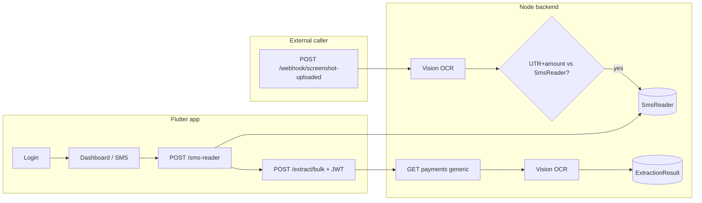

# Fintech App - End-to-End Flow

This document describes how the app, backend, payments API, and OCR extraction pipeline work together.

## 1) Login Flow

1. App opens `LoginScreen`.
2. Login API call:
   - `POST {BACKEND_URL}/admin/login`
3. On success, app stores:
   - JWT token
   - user id
   - username
   - role
4. App navigates to `DashboardScreen`.

## 2) Dashboard Flow

On boot, `main()` already calls **`SmsIngestService.start()`** if SMS permission was previously granted, so capture is not tied to having the dashboard open.

When the dashboard opens:

1. Requests SMS permission (if not yet granted).
2. If granted, ensures **`SmsIngestService.start()`** (telephony listener with **`listenInBackground: true`**) so new bank SMS are handled in **foreground, background, or after a cold start** (Android may deliver the SMS broadcast even when the app was killed, subject to OEM behavior).

Available actions:

- **Payments**: opens payment list using JWT.

## 3) SMS capture + save (global listener)

Implementation: `app/lib/sms_ingest_service.dart` + `app/lib/sms_telephony_bridge.dart`.

1. A **new** SMS arrives (device receives it on the default SMS subscription).
2. App filters likely banking SMS and extracts the same structured fields (`transactionType`, `amount`, `bankAccountLastFourDigits`, `utrNo`, `date`, `time`, `senderID`, `transactionId`).
3. `POST /api/v1/sms-reader` with that JSON.
4. On successful save, app triggers extraction: `POST /api/v1/extract/bulk` with `{ "jwtToken": "<JWT>" }` when a JWT is stored (after login).

Deduplication uses **SharedPreferences** (`sms_ingest_seen_keys`) so the same SMS is not posted twice across app restarts.

**Removed (by design):** scanning the SMS inbox in bulk, the **Read SMS** UI, and **`POST /sms-reader/bulk`**. Historical SMS that never arrive as a **new** message are not uploaded.

**Android manifest (required):** The app must declare `RECEIVE_SMS` and register `com.shounakmulay.telephony.sms.IncomingSmsReceiver` for `SMS_RECEIVED` (same as the [telephony example app](https://github.com/shounakmulay/Telephony/blob/master/example/android/app/src/main/AndroidManifest.xml)). The plugin does not merge this receiver; without it, **no incoming SMS reach the app**.

**Reality check (Android):** Some OEMs (battery savers, “auto-start” restrictions) can still delay or block delivery when the app is swiped away or the device is in deep sleep. If needed, users should disable battery optimization for this app and allow autostart (vendor-specific settings).

## 4) Backend SMS storage

Routes in `backend/routes/SmsReaderRoute.js`:

- `POST /sms-reader`
- `GET /sms-reader`
- `GET /sms-reader/:id`
- `DELETE /sms-reader/:id`

Controller behavior:

- Validates required SMS fields.
- Handles aliases (`senderId/senderID`, `accountLast4/bankAccountLastFourDigits`, etc.).
- Deduplicates and stores in `SmsReader` collection.

### SmsReader model (`backend/models/SmsReader.js`)

Each stored banking SMS includes at least: `amount`, `utrNo` (12 digits), `transactionType`, `bankAccountLastFourDigits`, `date`, `time`, `senderID`, optional `transactionId`.

- **`check`** (boolean, default `false`): set to **`true`** when a later **webhook screenshot** OCR result matches this row’s **UTR** and **amount** (see [Webhook screenshot flow](#10-webhook-screenshot-flow-fraud-check)). Used to mark that the payment was cross-verified against an uploaded screenshot.

## 5) Payments API Flow

`PaymentScreen` calls:

- `GET {BACKEND_URL}/payments`
- Header: `Authorization: Bearer <JWT>`

It displays payments in app and uses same JWT for extraction trigger flow.

## 6) OCR Extraction Flow

Routes in `backend/routes/ExtractionRoute.js`:

- `POST /extract`
- `POST /extract/bulk`

Service in `backend/extraction.js`:

1. Uses Google Vision:
   - `https://vision.googleapis.com/v1/images:annotate`
   - `TEXT_DETECTION`
2. Extracts OCR text:
   - `responses[0].fullTextAnnotation.text`
3. Extracts:
   - UTR (12 digits): `\\b\\d{12}\\b`
   - Amount: `(?:₹|Rs\\.?|INR)\\s?([0-9,]+(?:\\.\\d{1,2})?)`
4. Bulk processing:
   - batch size max 10
   - parallel per batch using `Promise.all`
5. Handles failures:
   - OCR fail -> null values + `FAILED`
   - UTR/amount missing -> `FAILED`

### Two ways OCR runs (both write `ExtractionResult`)

| Path | Trigger | Payments `GET`? |
|------|---------|------------------|
| **App-driven** | After SMS save, app calls `POST /api/v1/extract/bulk` with `{ "jwtToken": "<JWT>" }` | Yes — backend calls `GET {Backend_URL}/payments/generic` to collect `screenshotUrl` rows, then runs Vision on each image URL. |
| **Webhook-driven** | External system calls `POST /api/v1/webhook/screenshot-uploaded` with `screenshotUrl` | Optional — see webhook section (`PAYMENTS_VERIFY_JWT`). |

There is **no Redis or background worker** for the webhook: processing runs **in the same HTTP request** until Vision + DB updates complete (caller may wait several seconds).

## 7) Extraction Result Storage

Model: `backend/models/ExtractionResult.js`

Stored fields:

- `paymentId`
- `imageUrl` (unique)
- `utr`
- `amount`
- `status` (`SUCCESS` or `FAILED`)
- timestamps

Auto-save behavior:

- Extraction results are upserted by `imageUrl`.
- Existing URL updates existing record; new URL creates new record.

## 8) Required Environment Variables

### App (`app/.env`)

- `BACKEND_URL` (main auth/payments API base)
- `Backend_URL_LOCAL` (local backend base for sms/extract routes)

### Backend (`backend/.env`)

- `PORT`
- `MONGODB_URI`
- `Backend_URL` (payments list base; path `/payments/generic` is appended by `backend/paymentsApi.js` unless the URL already ends with `/payments/generic`)
- `Google_Vision_API_KEY`
- `WEBHOOK_SECRET` (must match header `x-webhook-secret` on webhook requests)
- Webhook HMAC: signing secret is configured in `backend/utils/security.js` (used with header `x-webhook-signature` and raw JSON body)
- `PAYMENTS_VERIFY_JWT` (optional): Bearer token for `GET` payments list during **webhook** verification; leave empty to skip that step
- `WEBHOOK_FORWARD_URL` (optional): if set, webhook pipeline POSTs the original payload to this URL after OCR/verify

## 10) Webhook screenshot flow (fraud check)

**Route:** `POST /api/v1/webhook/screenshot-uploaded`

**Headers:** `x-webhook-secret`, `x-webhook-signature` (HMAC over raw body), `Content-Type: application/json`

**Body (minimum):** `refId`, `screenshotUrl`; optional `amount`, `utr`

**Steps (in order, same process as the HTTP request):**

1. Validate secret and HMAC signature.
2. Create `WebhookEvent` (`status: pending`) or return **200** if `refId` already exists (idempotent duplicate).
3. **Google Vision** on `screenshotUrl` → extract UTR and amount (`backend/extraction.js` → `ExtractionResult` upserted by image URL).
4. **SMS cross-check** (`backend/utils/smsReaderWebhookMatch.js`): find `SmsReader` with same **12-digit `utrNo`** as OCR; compare **amount** (within 0.01). If both match, set **`check: true`** on that SMS document and log `UTR MATCH utr=... amount=...`.
5. Optional: **payments API verify** — `GET` payments list using `PAYMENTS_VERIFY_JWT`, compare screenshot URL / amounts / UTRs with OCR when configured.
6. Optional: **forward** JSON to `WEBHOOK_FORWARD_URL`.
7. Mark `WebhookEvent` as **`processed`** or **`failed`**.

**Success response (example):** HTTP **200** with `extraction` (utr, amount, status), `smsMatch`, `paymentsVerification`.

**Operational note:** The client must wait for OCR to finish; there is no job queue for this endpoint.

## 11) High-level diagram (conceptual)

## 12) Network Notes

- Backend listens on `0.0.0.0` for device access over LAN.
- For physical device testing, `Backend_URL_LOCAL` must use current laptop LAN IP.
- If laptop IP changes, update `app/.env` and restart app fully.

